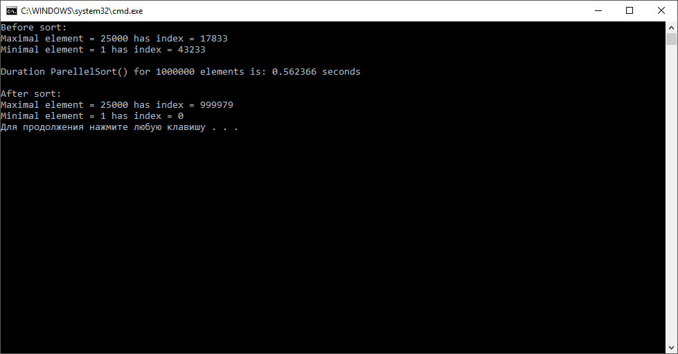

# Задание к занятию 2

## Описание

Исходный код находится в файле **Sourse.cpp**.

В файле реализованы все необходимые функции и добавлены замерщики вемени, как требовалось по заданию.

#### Задание 1.
С предстваленным кодом ознакомлен.

#### Задание 2.

Реализована функция **ReducerMinTest(…)**, см. **Source.cpp**, стр. 14.

Выполнена проверка корректности работы функции.

#### Задание 3.

Выполнены замеры времени работы **ParallelSort()** для увеличенного числа элементов исходного массива в 10, 50, 100 раз.

#### Задание 4.

Реализованна функция **CompareForAndCilk_For(...)**.
Результат сравнения приведён ниже.

#### Задание № 5.

Ответы на вопросы пункта 5 приведены в файле **Ответы на вопросы.pdf**.

